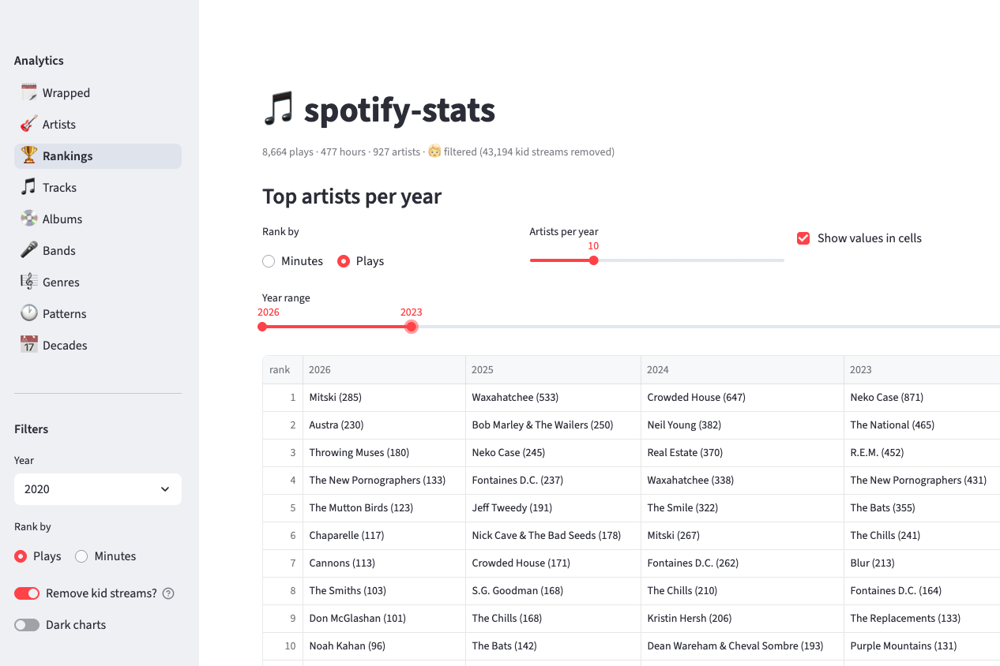

# spotify-stats

A personal Spotify listening-history dashboard built with [Streamlit](https://streamlit.io/).
It turns your Spotify **Extended Streaming History** export into the views that
Spotify Wrapped leaves out: how your taste shifts year over year, which artists,
albums, and decades dominate, when you actually listen, and deep-dives on any
band or group of bands.



A grouped sidebar navigates the views; shared filters (year, plays-vs-minutes,
kid-stream removal) apply across them; and the whole thing runs on *years* of
your history, not just the last twelve months.

## Features

- **🗓️ Wrapped** — an all-time snapshot (lifetime totals plus records: busiest
  day, longest streak, all-time #1s) and a Wrapped-style recap for any window.
- **🏆 Rankings** — your top artists for every year side by side, newest first,
  ranked by play count or minutes.
- **🎸 Artists / 🎵 Tracks / 💿 Albums / 🎼 Genres / 📅 Decades** — all-time and
  per-year tops, by plays or minutes.
- **🎤 Bands** — single-artist deep-dives (rank among your artists, peak year,
  listening clock) and saveable **groups** of bands with combined summaries.
- **🕐 Patterns** — an hour-of-day × day-of-week listening heatmap.
- **🔍 Explore / 📤 Export** — full-text search of the raw play log, and CSV exports.
- **🚫 Artist filters** — drop shared-account streams (e.g. a kid's listening)
  per artist, with year/month (`2019-06`) resolution or a keep-% split; toggle
  live from the sidebar.
- **🔄 Stay current** — one-click **Sync now** in the sidebar (plus an optional
  hourly background job) pulls recent plays on top of your export.

## Screenshots

**🗓️ Wrapped** — your all-time totals and records, plus a windowed recap:


**🎤 Bands** — bundle artists into groups and summarize them together:


**🕐 Patterns** — when you listen, by hour and day of week:


_Full-UI screenshots are regenerated with `python gen_guide_screenshots.py`. For
a complete walkthrough, see the **[User's Guide](docs/USER_GUIDE.md)**._

## Getting started (one-time setup)

You only do this once. After it, the app keeps itself current (see *Keeping your
data current* below). These steps assume no prior terminal experience — copy each
command exactly.

**1. Install Python.** You need Python 3.9 or newer. Check with:

```bash
python3 --version
```

If that errors, install it from <https://www.python.org/downloads/>.

**2. Get the code and install dependencies.** In a terminal, from the project
folder:

```bash
python3 -m venv .venv          # create an isolated environment
source .venv/bin/activate      # activate it (you'll see "(.venv)" in your prompt)
pip install -r requirements.txt
```

**3. Create a free Spotify app (for enrichment — genres, release dates).** Go to
<https://developer.spotify.com/dashboard>, click **Create app**, give it any name,
and set the **Redirect URI** to `http://127.0.0.1:8888/callback`. Open the app's
**Settings** and copy the **Client ID** and **Client secret**.

> ⚠️ Use the IP literal **`127.0.0.1`**, not `localhost` — Spotify no longer
> accepts `localhost` redirect URIs, and the string here must match
> `SPOTIFY_REDIRECT_URI` in your `.local.env` exactly.

**4. Save your credentials.** Make your own credentials file from the template:

```bash
cp example.env .local.env
```

Open `.local.env` in any text editor and paste your real values:

```
SPOTIFY_CLIENT_ID=<your Client ID>
SPOTIFY_CLIENT_SECRET=<your Client secret>
SPOTIFY_REDIRECT_URI=http://127.0.0.1:8888/callback
```

(`.local.env` is never committed to git. The redirect URI must match the one you
registered in the Spotify dashboard, character for character.)

**5. Request your listening history archive from Spotify.** This is the most
important step, and the one with a wait — start it early.

  - Go to your Spotify **Account → Privacy settings**
    (<https://www.spotify.com/account/privacy/>).
  - Scroll to **Download your data**. Spotify offers two kinds of export —
    **check the box for "Extended streaming history"** (the complete play-by-play
    history this app needs). The default "Account data" option is a smaller,
    less detailed summary and is *not* enough.
  - Click **Request data** and confirm via the email Spotify sends.
  - **Wait.** Extended history can take anywhere from a few hours to ~30 days to
    arrive (it usually lands in a few days). Spotify emails a download link when
    it's ready.

  When the zip arrives, unzip it. Inside is a folder named **`Spotify Extended
  Streaming History`** containing files like:

  ```
  Streaming_History_Audio_2016.json
  Streaming_History_Audio_2017_1.json
  ...
  Streaming_History_Video_2024.json      <- ignored (video, not music)
  ```

  Copy the **`Streaming_History_Audio_*.json`** files into this project's
  **`data/raw/`** folder. (You can copy the whole folder's contents if it's
  easier — the loader only reads the `Audio` files and ignores the rest.) Nothing
  in `data/` is ever committed to git.

  > Re-importing later: when you request a fresh export down the road, just drop
  > the new `Streaming_History_Audio_*.json` files into `data/raw/` (replacing the
  > old ones) and re-run the bootstrap in the next step.

**6. Build your data (the "bootstrap").** This loads your history and enriches it.
It makes hundreds of API calls, so it takes a few minutes:

```bash
python run_pipeline.py --bootstrap
```

**7. Open the dashboard:**

```bash
python -m streamlit run app.py
```

Your browser opens to the dashboard. **You're done** — step 6 never needs to
happen again unless you import a fresh full export.

## Keeping your data current

Your one-time export is a snapshot. To capture plays *since* the export, the app
syncs the most recent plays from Spotify's `recently-played` endpoint.

**First, authorize sync (one time).** This is separate from the enrichment
credentials and opens a browser to grant access:

```bash
python -m src.setup_tokens
```

Then choose how to keep current:

**Option A — click a button.** In the dashboard's left **sidebar**, the **Data**
panel shows your latest play and last sync; press **🔄 Sync now**. The endpoint
returns the last ~50 plays, so syncing roughly twice a day keeps gaps impossible
for most listeners.

**Option B — automate it (recommended).** Add a scheduled job so you never have
to remember.

On **macOS**, a ready-made LaunchAgent is included — it runs an hourly sync via
`scripts/auto_sync.sh` and logs to `data/sync.log`:

```bash
cp scripts/com.spotify-stats.sync.plist ~/Library/LaunchAgents/
launchctl load ~/Library/LaunchAgents/com.spotify-stats.sync.plist
# (edit the absolute paths in the plist / script to match your checkout first)
```

On **Linux**, a cron line does the same — run `crontab -e` and add (use your real
project path):

```bash
# sync at 8am and 8pm daily; log output for troubleshooting
0 8,20 * * * cd /path/to/spotify-stats && .venv/bin/python run_pipeline.py --sync >> data/sync.log 2>&1
```

Check `python run_pipeline.py --status` anytime to see the last sync time, total
plays, and whether you're at risk of missing plays (a >12h gap during heavy
listening can exceed the 50-play window).

## Command reference

```bash
python run_pipeline.py --bootstrap   # one-time: load export + full enrichment
python run_pipeline.py --sync        # incremental: fetch recent plays, dedupe, append
python run_pipeline.py --enrich      # re-run enrichment + rebuild (add --force to refetch)
python run_pipeline.py --status      # last sync time, total plays, gap risk
python -m streamlit run app.py       # launch the dashboard

# dev tool: top artists per year -> CSV / Markdown, no UI
python export_top_artists.py --help
```

## Project structure

```
app.py                  # Streamlit dashboard (sidebar nav + all views)
run_pipeline.py         # CLI: --bootstrap / --sync / --enrich / --status
export_top_artists.py   # dev tool: top-N artists per year → CSV / Markdown
gen_screenshots.py      # dev tool: render bare Plotly figures → docs/screenshots/
gen_guide_screenshots.py# dev tool: full-UI screenshots via Playwright → docs/screenshots/guide/
scripts/                # macOS LaunchAgent + wrapper for hourly auto-sync
src/
  config.py             # paths, constants, OAuth config
  fetch_data.py         # Spotify OAuth/refresh, recently-played, GDPR loader
  enrich_data.py        # track + artist metadata enrichment (Spotify API)
  process_data.py       # DataFrame build, aggregations, exclusions, groups
  charts.py             # Plotly figure factories
docs/
  USER_GUIDE.md         # full walkthrough of the dashboard
  HOSTED_USER_GUIDE.md  # draft design for a hosted, bring-your-own-history mode
  screenshots/          # README + guide images (committed)
data/                   # local data (gitignored)
```

## Data retrieval & storage

This app is **local-first**: it reads and writes files on your machine under
`data/`, and that whole directory is gitignored — your listening history and
credentials never get committed.

### Where the data comes from

1. **GDPR export (the backbone).** Your full history comes from Spotify's
   *Download your data → Extended streaming history* export, not the API. Spotify
   emails a zip; you unzip the `Streaming_History_Audio_*.json` files into
   `data/raw/`. This is the only complete source of your play history — the API
   cannot return years of past plays.
2. **Spotify Web API (enrichment).** The export has no genre, release date, or
   track duration, so `run_pipeline.py` looks each unique track and artist up via
   the `/tracks` and `/artists` endpoints and caches the results. This uses the
   **Client Credentials** flow (app-only) — just your `SPOTIFY_CLIENT_ID` /
   `SPOTIFY_CLIENT_SECRET`, **no user login or browser step required**.
3. **Recently-played (incremental sync).** Keeping the dataset current after the
   export uses `/me/player/recently-played`, which *does* require a user-authorized
   token (`python -m src.setup_tokens`, a one-time browser OAuth). This endpoint
   returns at most the last 50 plays, so sync only fills small gaps.

### What gets stored, and where

| Path | Contents | Source | Committed? |
|---|---|---|---|
| `data/raw/Streaming_History_Audio_*.json` | Raw GDPR play history | Your export | No (gitignored) |
| `data/enriched/track_metadata.json` | Per-track duration / release / album | API cache | No |
| `data/enriched/artist_metadata.json` | Per-artist genres / popularity | API cache | No |
| `data/processed/plays.parquet` | Merged, enriched, one row per play | Built locally | No |
| `data/exclusions.json` | Your shared-account filter rules | You / Artist filters page | No |
| `data/groups.json` | Saved band groups | You / Bands page | No |
| `data/settings.json` | Timezone, full-listen threshold | You | No |
| `data/spotify_tokens.json` | User OAuth tokens (sync only) | `setup_tokens` | No |
| `.local.env` | `SPOTIFY_CLIENT_ID` / `SECRET` | You | No |

Enrichment caches are written once and reused — tracks/artists are never
re-fetched unless the cache is deleted, keeping repeat runs fast and within API
rate limits. `plays.parquet` is the single artifact the dashboard reads at
startup (cached in-memory by Streamlit). Exclusions are applied *on top of*
`plays.parquet` at view time, so toggling the "Remove kid streams?" filter never
rewrites the data.

### Running in a browser — and what the local-first design means for hosting

Running `streamlit run app.py` serves the dashboard to a browser tab, but the
**Python process and all `data/` files still live on the machine that ran the
command** — your laptop. The browser is just the UI. A few consequences:

- **It is single-user and personal.** There is no login or per-user separation.
  If you deploy it to a shared/public host (e.g. Streamlit Community Cloud),
  anyone with the URL sees *your* listening data. Keep hosted instances private.
- **The repo has no data.** Because `data/` is gitignored, a fresh clone or a
  cloud deploy starts empty. A hosted instance has nothing to show until you get
  `plays.parquet` (and the enrichment caches) onto it — by uploading the files or
  running the pipeline there. The app shows a "run the pipeline" message until
  then.
- **Secrets must come from the host, not `.local.env`.** `.local.env` is
  gitignored and won't exist on a deploy. Provide `SPOTIFY_CLIENT_ID` /
  `SPOTIFY_CLIENT_SECRET` through the host's secrets mechanism (e.g. Streamlit
  Cloud *Secrets*, or environment variables).
- **The OAuth sync flow assumes a loopback redirect.** `setup_tokens` redirects
  to `http://127.0.0.1:8888/callback`, which only works when you run it on your
  own machine. The browser-only/hosted path can't complete that handshake without
  a publicly reachable redirect URI registered in your Spotify app.
- **Ephemeral hosts don't persist writes.** On platforms with an ephemeral
  filesystem, anything the app writes (updated `plays.parquet`, edited
  `exclusions.json`) is lost on restart. Treat hosted instances as read-only
  views of data you built locally.

In short: do the data work locally (export → `run_pipeline.py`), and treat any
browser/hosted instance as a viewer of those locally-built files.

> A **multi-user, bring-your-own-history** hosted mode (each visitor uploads
> their own export, processed per session) is sketched as a design doc in
> [`docs/HOSTED_USER_GUIDE.md`](docs/HOSTED_USER_GUIDE.md) — not yet implemented.

## Contributors

This project is developed through **pair programming with
[Claude Code](https://www.anthropic.com/claude-code)**, Anthropic's agentic
command-line coding tool. The human partner sets direction, reviews, and tests
against real data; Claude Code drafts and iterates on the implementation. Design,
architecture, and feature decisions are made collaboratively in that loop.

## Acknowledgements

Modeled after the [strava-stats](https://github.com/jimmoffitt/strava-stats)
dashboard, which established the `fetch_data` / `process_data` / `charts` /
Streamlit-tabs pattern reused here.
