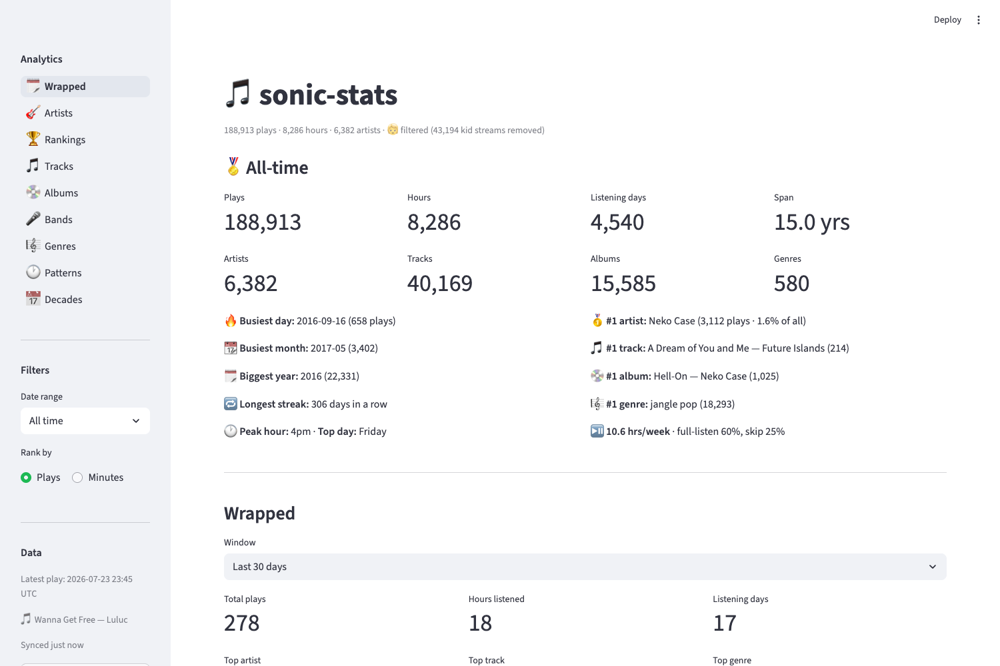
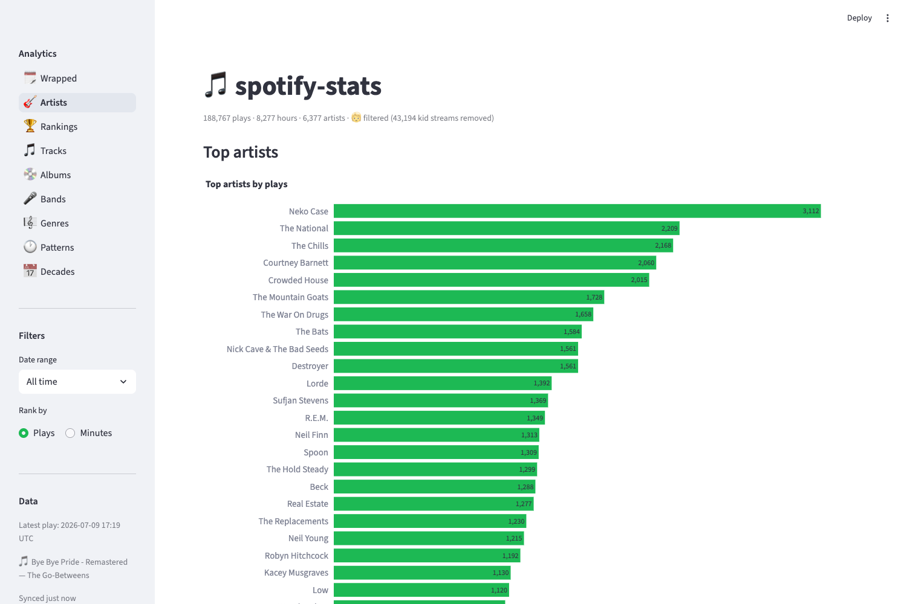
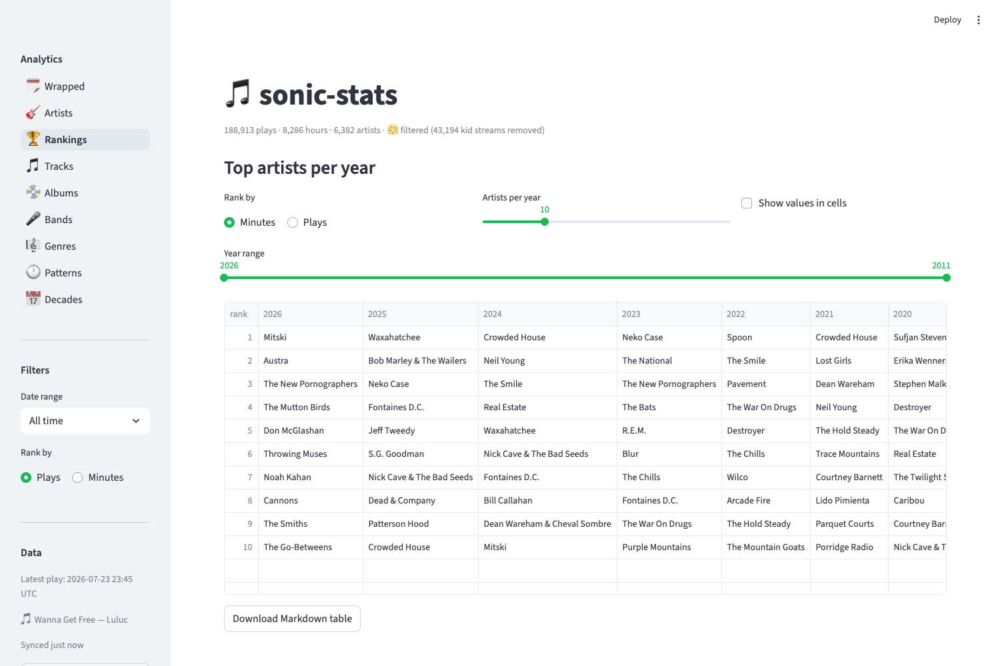
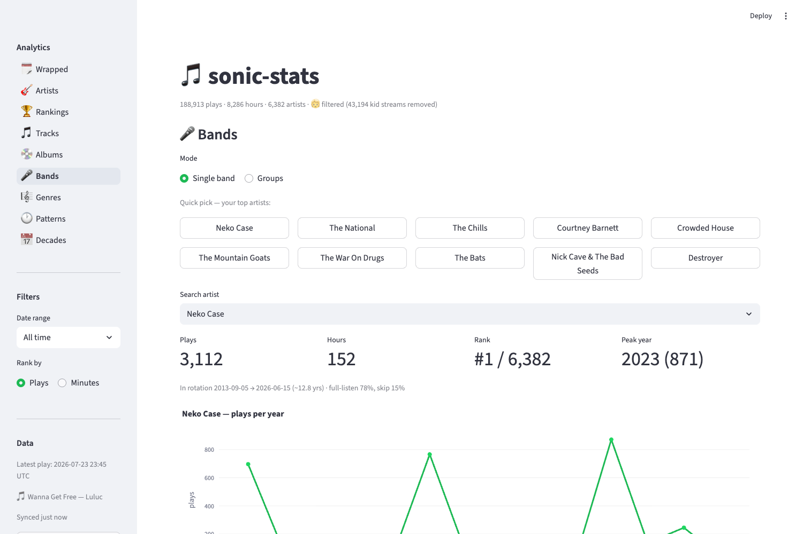
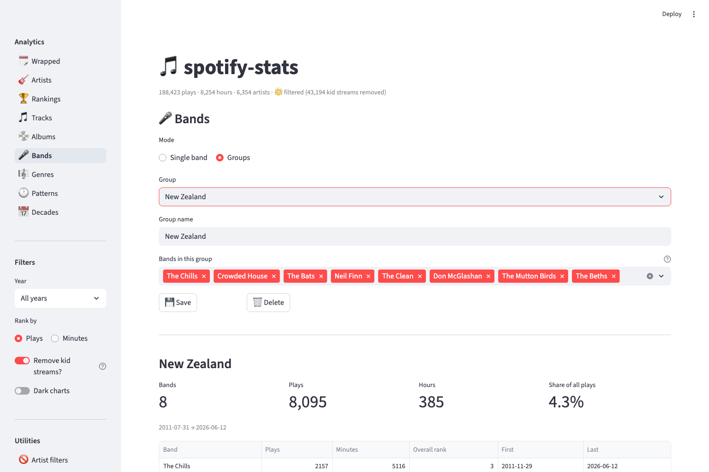
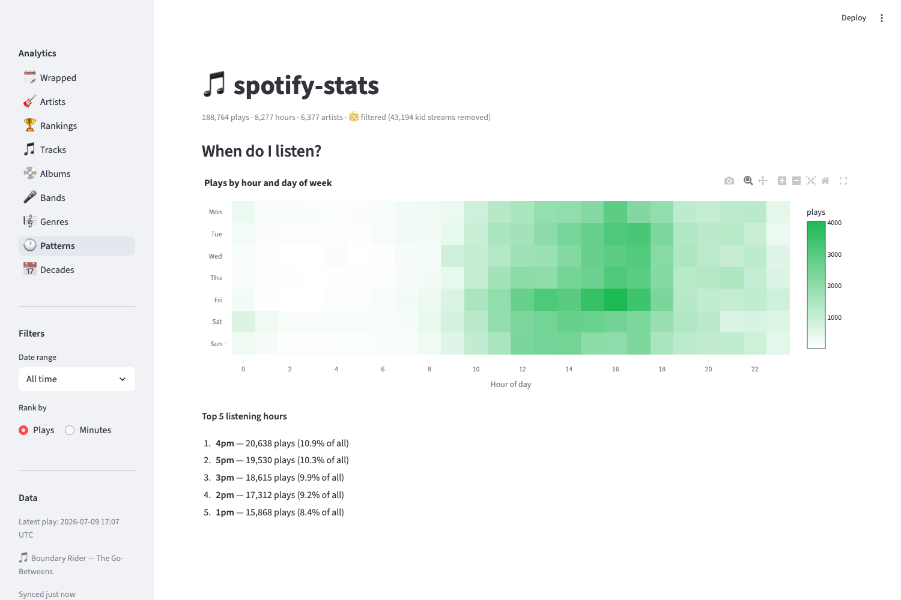
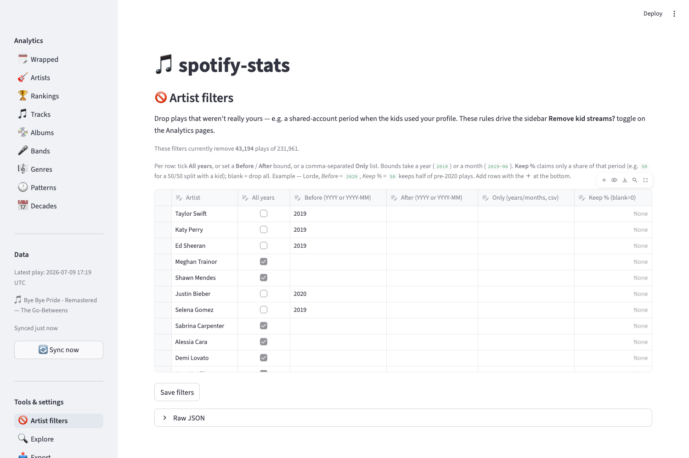
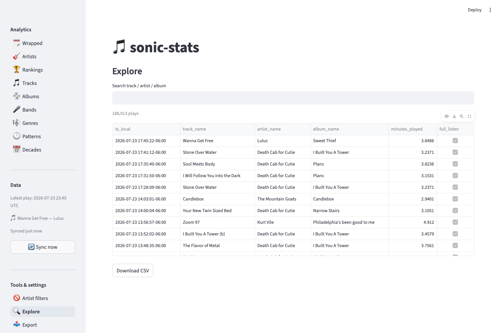
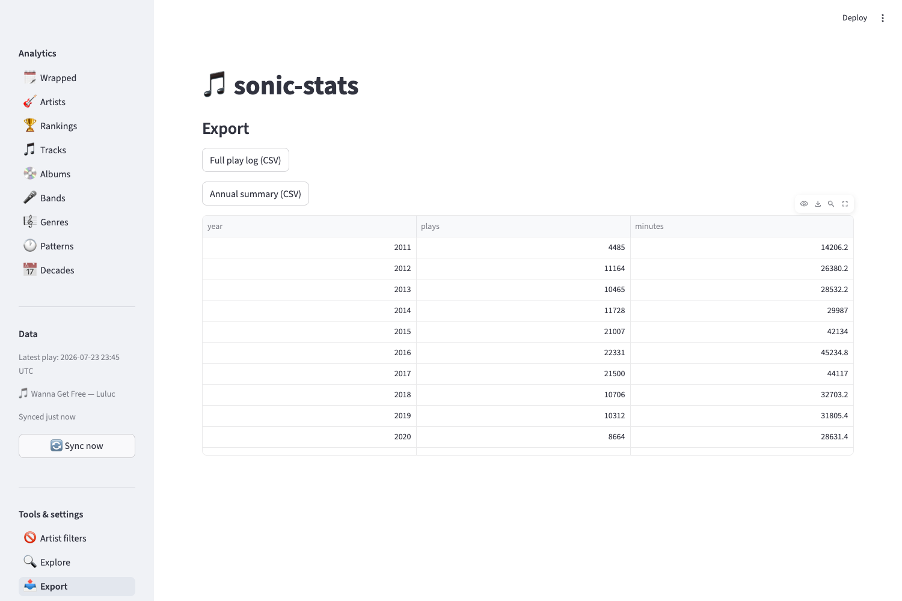
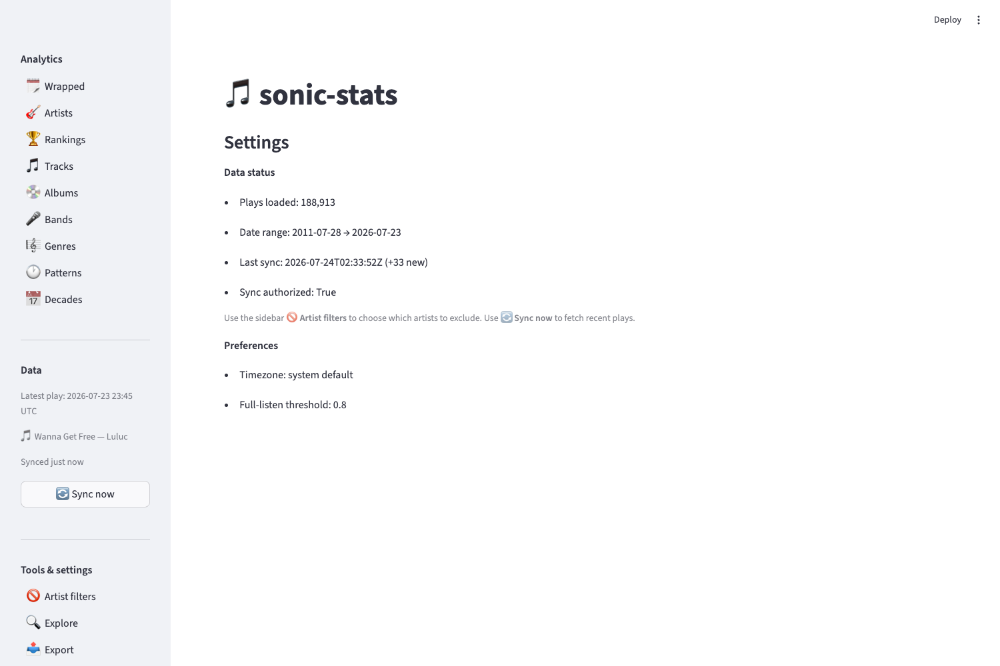

# sonic-stats — User's Guide

A personal dashboard for your **entire** Spotify listening history — not just
the last year. It loads your Extended Streaming History export (and keeps it
fresh with incremental syncs), then turns ~years of plays into interactive
charts, rankings, and summaries.

---

## What it does

At a glance, sonic-stats gives you:

- **🗓️ Wrapped** — an all-time snapshot (totals + records) plus a Spotify-Wrapped-style
  summary for any window (last 30 days, a single year, or all-time).
- **🎸 Artists / 🎵 Tracks / 💿 Albums / 🎼 Genres** — your top lists, ranked by
  plays or minutes, for any year or all-time.
- **🏆 Rankings** — a "who was #1 each year" table, newest year first.
- **🎤 Bands** — deep-dive on a single artist, *and* build saved **groups** of
  bands (e.g. a "New Zealand" group) with combined summaries.
- **🕐 Patterns** — when you listen, as an hour-by-weekday heatmap.
- **📅 Decades** — your listening by the release decade of the music.
- **🔍 Explore / 📤 Export / ⚙️ Settings** — search the raw play log, download
  CSVs, and manage data + filters.

Two cross-cutting features shape everything:

- **Kid-stream filtering.** Shared-account years pollute personal stats. The
  **Remove kid streams** toggle drops configurable artists/years so the numbers
  reflect *your* listening.
- **Plays vs. minutes.** Every ranking can be sorted by play count or total
  listening time via the **Rank by** control.

---

## Get started

### 1. Prerequisites
- **Python 3.9+** and this repository.
- Your **Spotify Extended Streaming History** export. Request it at
  [spotify.com/account/privacy](https://www.spotify.com/account/privacy) →
  *Extended streaming history*. Spotify emails a `.zip` (it can take a few days).
- A **Spotify app** (free) at the
  [Developer Dashboard](https://developer.spotify.com/dashboard) for the Client
  ID/Secret — only needed for metadata enrichment and syncing.

### 2. Install
```bash
python3 -m venv .venv
.venv/bin/pip install -r requirements.txt
```

### 3. Configure credentials
Copy `example.env` to `.local.env` and fill in your Spotify app's values:
```
SPOTIFY_CLIENT_ID=...
SPOTIFY_CLIENT_SECRET=...
SPOTIFY_REDIRECT_URI=http://127.0.0.1:8888/callback
```
> **Note:** Spotify no longer accepts `localhost` redirect URIs — use the IP
> literal `127.0.0.1`, and register the *identical* string in your app's
> dashboard under **Redirect URIs**.

### 4. Launch and load your history
```bash
.venv/bin/python -m streamlit run app.py
```
On first run, the app opens to a guided screen instead of the dashboard: a
popover reminds you how to request your export from Spotify if needed, and a
file picker takes the `.zip` directly — no unzipping or copying files by hand.
Click **Build my dashboard**; it enriches tracks/artists via the Spotify API
(one-time, a few minutes) and the **Wrapped** page loads when done. That's it —
everything below is the tour.

> Prefer the terminal? Drop the unzipped `Streaming_History_Audio_*.json`
> files into `data/raw/` and run `.venv/bin/python run_pipeline.py --bootstrap`
> instead of using the upload screen.

### 5. (Optional) Keep it fresh
To pull plays since your export, authorize once, then sync:
```bash
.venv/bin/python -m src.setup_tokens        # one-time browser auth
.venv/bin/python run_pipeline.py --sync     # or use ⚙️ Settings → Sync Now
```
A LaunchAgent can run the sync hourly in the background — see the README.

---

## A tour of the dashboard

### The sidebar

The left sidebar is mission control, split into four blocks:

- **Analytics** — the nine analysis pages. Click to switch; your place sticks
  even after you press a button or edit a table.
- **Filters** — shared controls for the Analytics pages:
  - **Date range** — *All time*, *Last 7 days*, *Last 30 days*, *This month*,
    or a single year.
  - **Rank by** — Plays or Minutes.
- **Data** — how current your data is: the timestamp (UTC) and track/artist of
  your latest play, how long ago you last synced, and a **🔄 Sync now** button.
- **Tools & settings** — Artist filters, Explore, Export, and Settings, plus
  two options that apply everywhere (not just the Analytics pages):
  - **Remove kid streams?** — apply your exclusions (on by default).
  - **Dark charts** — light/dark chart theme.

### 🗓️ Wrapped — start here

The Wrapped page opens with an **All-time** panel: lifetime totals (plays,
hours, unique artists/tracks/albums/genres, span) and a set of **records** —
your busiest day ever, biggest year, longest listening streak, peak hour, and
your all-time #1 artist/track/album/genre. Below it, the **Wrapped** summary
recaps any window you pick (last 30 days, a year, or all-time).



### 🎸 Artists, 🎵 Tracks, 💿 Albums, 🎼 Genres

Your top-25 lists. Use the sidebar **Date range** to scope them and **Rank by**
to switch between play count and listening time. The header caption always
tells you how many plays/hours/artists are in the current view.



### 🏆 Rankings — who was #1 each year

A "rank chart": rows are ranks 1–N, columns are years, each cell is the artist
who held that rank that year. Years read **newest-first** (current year on the
left). Tune *Artists per year*, switch Minutes/Plays, narrow the **Year range**
slider, or download the table as Markdown.



### 🎤 Bands — single artists and saved groups

**Single band** mode: search any artist (or use the quick-pick buttons for your
top 10) to see their plays, hours, **rank among all your artists**, peak year,
the years they've been in rotation, plays-per-year, top tracks/albums, and a
personal listening clock.



**Groups** mode lets you bundle bands and analyze them together. Pick a saved
group (or **➕ New group**), assemble the bands with the multiselect, and
**Save**. The summary shows the group's combined plays/hours, its **share of
all your listening**, and a per-band breakdown. Below, a "New Zealand" group of
8 bands accounts for 4.3% of all plays:



### 🕐 Patterns & 📅 Decades

**Patterns** plots plays across hour-of-day × day-of-week, so your listening
rhythm (late-night sessions, weekday commutes) pops out. Below the heatmap,
two ranked lists give a quick, exact read without having to squint at the
grid: **Times of week** (your top 5 specific day+hour slots, e.g. "Friday
4pm") and **Top 5 listening hours** (the same ranking collapsed across all
days, e.g. "4pm"). **Decades** breaks listening down by the *release* decade
of the music.



---

## Tools & settings

### 🚫 Artist filters — make the stats *yours*

**Why use it:** shared a Spotify account during some years (kids on your
profile, a partner's phase)? Those plays distort every chart. Artist filters let
you drop them. Each row removes an artist for **all years**, **before/after** a
given year (or month, e.g. `2019-06`), **specific years**, or a **Keep %** share
— so you can split a shared artist 50/50 rather than dropping them outright. A
live line shows how many plays the current rules remove. The rules are stored
once and switched on/off everywhere via the sidebar **Remove kid streams?**
toggle.



### 🔍 Explore — find the needle in the play log

**Why use it:** the Analytics pages summarize; Explore lets you *interrogate*.
When you want to answer a specific question — "what was that song I had on
repeat in 2019?", "did I ever actually listen to this album, or just one
track?", "show me every play of this artist" — Explore is the raw, searchable
record. Type any track, artist, or album fragment and it filters the full play
log (timestamps, what played, minutes, whether it was a full listen) down to
matching rows, newest first. It's also the quickest way to sanity-check the
data behind a chart.



### 📤 Export — take your data with you

**Why use it:** the dashboard is for browsing; Export is for everything *else*
you might want to do with the numbers. Pull the **full play log** or an
**annual summary** as CSV to drop into a spreadsheet, feed another tool, archive
a snapshot, or share a slice with a friend. Because exports respect the current
filters, you can, say, flip on *Remove kid streams*, pick a year, and export
exactly that view — a clean, portable copy of just the listening you care about.



### ⚙️ Settings — data status & preferences

Settings is a quick read-out, not a control panel (the two things you act on —
syncing and artist filters — have their own homes, below):

- **Data status** — plays loaded, date range, last sync, and whether sync is
  authorized.
- **Preferences** — your timezone and the full-listen threshold.



### Keeping data fresh — the sidebar **Data** section

Syncing is a primary action, so it lives in its own block on every page: it
shows the timestamp (UTC) and track/artist of your **latest play**, how long
ago you last synced, and a **🔄 Sync now** button that pulls your most recent
plays from Spotify's recently-played feed (after the one-time authorization in
*Get started* step 5).

---

## Tips

- **Numbers look off?** Check the **Remove kid streams** toggle and the **Date
  range** filter in the sidebar — together they decide what's counted.
- **All-time vs. windowed.** The Wrapped All-time panel and the Bands tab ignore
  the **Date range** filter (they're all-time by nature) but still honor the
  kid-stream toggle.
- **Regenerate these screenshots** anytime with
  `python gen_guide_screenshots.py`.
